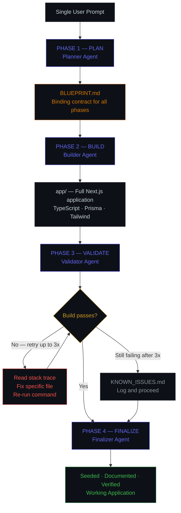
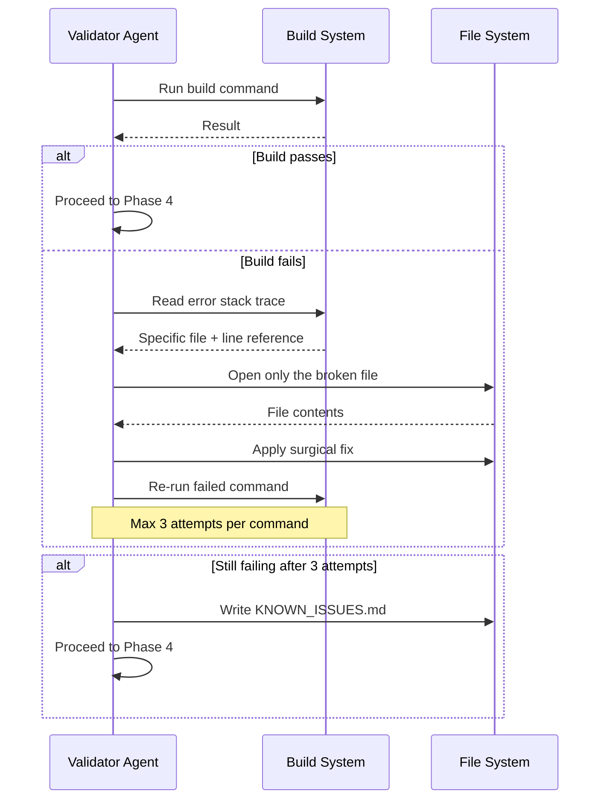

<div align="center">

<br/>

<h1>AURORA</h1>

### Autonomous Development System

*One prompt. Four agents. Zero human intervention. A working application.*

<br/>

[](https://claude.ai/code)&nbsp;
[](https://nextjs.org)&nbsp;
[](https://typescriptlang.org)&nbsp;
[](https://prisma.io)&nbsp;
[](https://github.com/AKSINGH-0704/aurora-autonomous-dev-system)&nbsp;
[](https://github.com/AKSINGH-0704/aurora-autonomous-dev-system)

<br/>

| Phase | Agent | Status |
|:-----:|:------|:------:|
| 01 | Planner — Blueprint generation | `● Operational` |
| 02 | Builder — Application scaffolding | `● Operational` |
| 03 | Validator — Self-healing build loop | `● Operational` |
| 04 | Finalizer — Seed, verify, package | `● Operational` |

<br/>

[System Flow](#system-flow) &nbsp;·&nbsp; [Agent Pipeline](#agent-pipeline) &nbsp;·&nbsp; [What Makes It Different](#what-makes-aurora-different) &nbsp;·&nbsp; [Run It](#usage)

<br/>

</div>

---

<br/>

## The Problem With AI Code Generators

Most AI coding tools operate on a "generate and hope" model. They output thousands of lines of code, hallucinate dependencies, produce files that reference imports that don't exist, and leave the user to debug the mess. The code looks right. It just doesn't run.

AURORA treats every line of generated code as untrusted until proven by the compiler. The system doesn't consider a task complete until `npm run build` exits with code 0. If it doesn't — it reads the error, opens the specific broken file, applies a targeted fix, and tries again. Completion is earned, not declared.

<br/>

## System Flow



<br/>

## Agent Pipeline

Each phase operates as an isolated agent. Outputs from one phase become the structured inputs for the next. No agent reinterprets prior decisions — it reads the artifact and executes against it exactly.

<div align="center">

| Phase | Agent | Consumes | Produces |
|:-----:|:------|:---------|:---------|
| 01 | **Planner** | User prompt | `BLUEPRINT.md` — schema, routes, pages, file tree |
| 02 | **Builder** | `BLUEPRINT.md` | `app/` — full Next.js app, all routes and components |
| 03 | **Validator** | `app/` source tree | Verified build OR `KNOWN_ISSUES.md` |
| 04 | **Finalizer** | Validated build | Seed data, `app/README.md`, completion summary |

</div>

**The binding contract:** `BLUEPRINT.md` is the single source of truth. If a feature is not in the blueprint, it does not get built — no additions, no omissions, no improvisation between phases.

<br/>

## Self-Healing Validation Loop



The validator reads only the file named in the error trace — not the full codebase. It fixes the specific issue without touching surrounding code. After 3 failed attempts per command, errors are logged to `KNOWN_ISSUES.md` and execution continues. The system never loops indefinitely — it acknowledges failure and moves forward.

<br/>

## What Makes AURORA Different

**Blueprint as binding contract**
The Planner generates a structured `BLUEPRINT.md` defining every database table, API route, frontend page, and file path before a single line of code is written. The Builder implements it exactly. This eliminates hallucinated features, mismatched schemas, and missing dependencies between planning and implementation.

**Self-healing validation**
The Validator doesn't report errors — it fixes them. It reads `stderr`, identifies the exact file and line from the stack trace, opens only that file, applies the minimal fix, and re-runs. Most systems crash on first error. AURORA corrects itself.

**Stateless shell awareness**
Claude Code runs each bash command in an isolated subshell where `cd` does not persist between calls. AURORA is engineered around this constraint — every command is explicitly chained with `cd app &&` to guarantee correct execution regardless of shell state.

**Domain-aware planning**
The Planner integrates Context7 MCP to research domain-specific patterns before generating the blueprint. When building a medical or financial application, it looks up best practices first — it doesn't guess.

**Graceful failure acknowledgment**
If validation cannot resolve an issue after 3 attempts, the error is logged to `KNOWN_ISSUES.md` and the pipeline proceeds. The system completes predictably — it never hangs, never silently fails, and never pretends an unresolved issue doesn't exist.

<br/>

## Dual-Layer Architecture

AURORA operates across two distinct environments.

<div align="center">

| Dimension | Orchestration Layer | Generated Target Layer |
|:----------|:-------------------|:----------------------|
| What it is | The AURORA agent pipeline | The application being built |
| Environment | Claude Code agent runtime | Next.js 14 App Router |
| Language | Agent instructions + bash | TypeScript (strict mode) |
| State | Stateless — chained commands | Persistent — SQLite via Prisma |
| Validation target | Phase handshake completion | `npm run build` exit code 0 |
| Failure handling | Retry + `KNOWN_ISSUES.md` | TypeScript compiler errors |
| Artifact produced | `BLUEPRINT.md`, phase outputs | `app/` — working application |

</div>

<br/>

## Operational Constraints

<div align="center">

| Constraint | Purpose |
|:-----------|:--------|
| No placeholder code | Every generated line must be functional — no `// TODO`, no stubs |
| No validation skipping | Each phase must complete before the next begins |
| No uncontrolled file generation | Only files in `BLUEPRINT.md` get created |
| No persistent server execution | Prevents pipeline deadlock from hanging processes |
| No inter-phase reinterpretation | Agents consume artifacts — they do not re-derive requirements |
| Bounded retry execution | 3 attempts per command — no runaway correction loops |
| Stateless shell handling | All commands use explicit `cd app &&` path chaining |

</div>

<br/>

## What This System Is Not

<div align="center">

| Not designed for | Reason |
|:----------------|:-------|
| Infinite autonomous execution | Execution is bounded by design — not by limitation |
| Unrestricted file generation | Blueprint contract enforced at every phase |
| Production deployment | Focus is application generation and build verification |
| Self-modification | Deterministic behavior requires stable orchestration instructions |
| General-purpose agent | Stack and patterns are fixed for reproducibility |

</div>

<br/>

## What AURORA Produces

<div align="center">

| Output | Description |
|:-------|:------------|
| `BLUEPRINT.md` | Structured app plan — schema, routes, pages, file tree |
| `app/` | Complete Next.js 14 application, scaffolded and wired |
| `app/prisma/schema.prisma` | Database schema matching blueprint exactly |
| `app/src/app/api/` | All API route handlers |
| `app/src/app/` + `components/` | All frontend pages and components |
| `app/prisma/seed.ts` | Realistic seed data — minimum 5 records per table |
| `app/README.md` | Project documentation with exact setup commands |
| `KNOWN_ISSUES.md` | Honest log of unresolved build issues (if any) |

</div>

<br/>

## Usage

```bash
git clone https://github.com/AKSINGH-0704/aurora-autonomous-dev-system.git
cd aurora-autonomous-dev-system
claude
```

Then enter your prompt:

```
Build a role-based telemedicine portal where doctors can manage appointments
and patients can securely submit medical histories, with a dashboard
showing appointment statistics and status tracking.
```

AURORA handles everything from here. Typical execution: ~9 minutes from prompt to working application. Do not interrupt. When complete, run the startup command from the completion summary:

```bash
cd app && npm install && npx prisma db push && npx prisma db seed && npm run dev
```

<br/>

## Engineering Takeaways

- Artifact contracts between phases eliminated the most common failure mode in LLM code generation — context drift causing mismatched assumptions between planning and implementation
- Bounded retry semantics with explicit failure logging produced more reliable pipeline completion than open-ended correction loops
- Stateless shell execution was a non-obvious constraint requiring a specific architectural solution — not all agentic environments behave like persistent terminals
- TypeScript strict mode functions as a secondary validator — type errors surfaced in Phase 3 that would have been silent runtime failures in a loosely-typed setup
- Fixing the tech stack per-run reduced error entropy significantly — the validator encounters the same error patterns across projects, making corrections more accurate

<br/>

## Project Structure

<details>
<summary>View repository structure</summary>

```
aurora-autonomous-dev-system/
│
├── claude.md                        # Master orchestrator — pipeline logic and hard constraints
├── README.md
│
└── .claude/
    ├── settings.json                # Permissions, auto-approvals, MCP configuration
    └── skills/
        ├── 01-planner/SKILL.md      # Requirement analysis → BLUEPRINT.md
        ├── 02-builder/SKILL.md      # Full-stack code generation from blueprint
        ├── 03-validator/SKILL.md    # Self-healing build validation loop
        └── 04-finalizer/SKILL.md    # Seed data, documentation, final verification
```

No application code lives in this repository. Every application is generated autonomously at runtime.

</details>

<br/>

---

<div align="center">

<br/>

Built by **[AKSINGH-0704](https://github.com/AKSINGH-0704)**

*AURORA doesn't generate code. It engineers software.*

<br/>


**Built for:** Claude Builders Club × APOGEE 2026

<br/>

</div>
