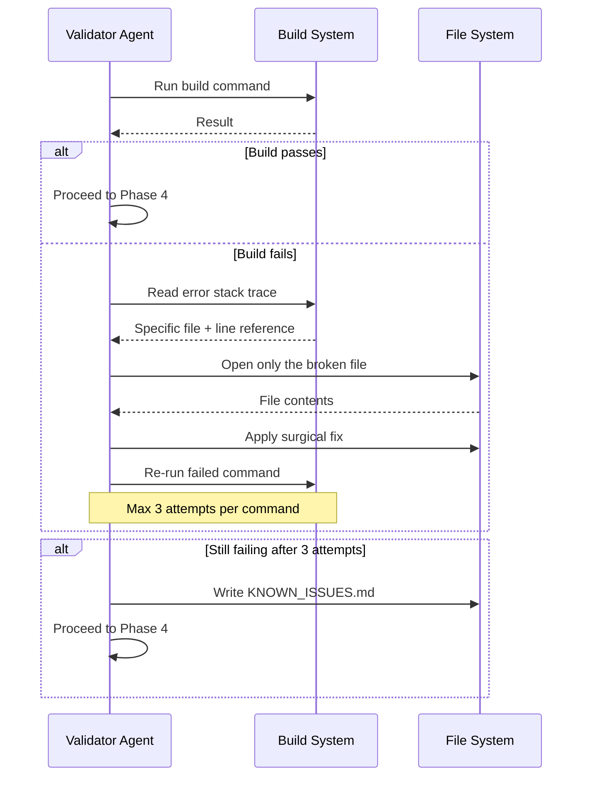

<div align="center">

<br/>

<h1>AURORA</h1>

### Autonomous Development System

*Deterministic execution pipeline — structured planning, constrained generation, iterative validation, artifact-driven orchestration.*

<br/>

[](https://claude.ai/code)&nbsp;
[](https://nextjs.org)&nbsp;
[](https://typescriptlang.org)&nbsp;
[](https://prisma.io)&nbsp;
[](https://github.com/AKSINGH-0704/aurora-autonomous-dev-system)&nbsp;
[](https://github.com/AKSINGH-0704/aurora-autonomous-dev-system)

<br/>

| Phase | Agent | Status |
|:-----:|:------|:------:|
| 01 | Planner — Blueprint generation | `● Operational` |
| 02 | Builder — Application scaffolding | `● Operational` |
| 03 | Validator — Self-healing build loop | `● Operational` |
| 04 | Finalizer — Seed, verify, package | `● Operational` |

<br/>

[System Flow](#system-flow) &nbsp;·&nbsp; [Agent Pipeline](#agent-pipeline) &nbsp;·&nbsp; [Design Decisions](#design-decisions) &nbsp;·&nbsp; [Run It](#quickstart)

<br/>

</div>

---

<br/>

## What AURORA Is

AURORA is a structured execution pipeline that transforms a single prompt into a fully compiled, seeded, and documented application — without any user input after the initial trigger. It is not a code suggestion tool. It is a four-phase agent system where every phase consumes structured artifacts from the previous phase, operates within explicit constraints, and must pass validation before the next phase begins.

The problem it solves: single-shot LLM code generation produces unverified output — mismatched imports, broken type chains, unrun builds. AURORA treats software generation as a compilation target, not a text generation task. Completion is only declared when `npm run build` exits with code 0.

<br/>

## System Flow


<br/>

## Agent Pipeline

Each phase operates as an isolated agent. Outputs from one phase become the structured inputs for the next. No agent reinterprets prior decisions — it reads the artifact and executes against it exactly.

<div align="center">

| Phase | Agent | Consumes | Produces |
|:-----:|:------|:---------|:---------|
| 01 | **Planner** | User prompt | `BLUEPRINT.md` — app overview, schema, API routes, pages, file tree |
| 02 | **Builder** | `BLUEPRINT.md` | `app/` — scaffolded Next.js app, all routes, components, DB schema |
| 03 | **Validator** | `app/` source tree | Verified build OR `KNOWN_ISSUES.md` |
| 04 | **Finalizer** | Validated build | Seed data, `app/README.md`, build confirmation, completion summary |

</div>

**The binding contract:** `BLUEPRINT.md` is the single source of truth. If a feature is not in the blueprint, it does not get built. No additions, no omissions, no improvisation between phases.

<br/>

## Self-Healing Validation Loop

The validator phase is where the system proves it actually works. It does not declare completion — it proves it.



**Surgical correction:** The validator reads only the file named in the error trace — not the full codebase. It fixes the specific issue without refactoring surrounding code. This keeps retry behavior fast and targeted.

**Bounded recovery:** 3 attempts per failing command. After that, errors are logged to `KNOWN_ISSUES.md` and execution continues. The system never loops indefinitely — it acknowledges failure explicitly and moves forward.

<br/>

## Design Decisions

Every constraint in this system exists for a reason.

<div align="center">

| Decision | Reasoning |
|:---------|:----------|
| **Blueprint as binding contract** | Eliminates scope drift between agents. No phase can add features not specified — prevents hallucinated routes, mismatched schemas, and inter-agent inconsistency |
| **Fixed tech stack** | Deliberating on technology per project introduces non-determinism. A fixed stack makes build error patterns predictable and the validator's correction patterns learnable |
| **`cd app && <command>` chaining** | Claude Code executes each shell command in an isolated stateless subshell — `cd` does not persist between commands. Every command must carry its own directory context |
| **No `npm run dev` in pipeline** | Persistent servers hang the pipeline indefinitely. The build target is a verifiable exit code, not a running process |
| **Max 3 retries then log** | Infinite retry loops are a failure mode, not a recovery strategy. `KNOWN_ISSUES.md` is honest failure acknowledgment — the system knows what it couldn't fix |
| **No user clarification** | Ambiguities are resolved using reasonable defaults and domain research. Every decision is made forward — the pipeline never pauses |
| **No placeholder code** | Every line generated must be functional. `// TODO`, `// ...`, and stub functions invalidate the validation loop — they pass the compiler but break the application |
| **Post-split normalization** | Scaling parameters computed on training partition only — prevents test distribution leaking into feature scaling |

</div>

<br/>

## Dual-Layer Architecture

AURORA operates across two distinct environments. Conflating them degrades architectural clarity.

<div align="center">

| Dimension | Orchestration Layer | Generated Target Layer |
|:----------|:-------------------|:----------------------|
| What it is | The AURORA agent pipeline | The application being built |
| Environment | Claude Code agent runtime | Next.js 14 App Router |
| Language | Agent instructions + bash | TypeScript (strict mode) |
| State | Stateless — chained commands | Persistent — SQLite via Prisma |
| Validation target | Phase handshake completion | `npm run build` exit code 0 |
| Failure handling | Phase retry + `KNOWN_ISSUES.md` | TypeScript compiler errors |
| Artifact produced | `BLUEPRINT.md`, phase outputs | `app/` — full working application |

</div>

<br/>

## Operational Constraints

<div align="center">

| Constraint | Purpose |
|:-----------|:--------|
| No placeholder code | Every generated line must be functional and compilable |
| No validation skipping | Each phase must complete before the next begins |
| No uncontrolled file generation | Only files specified in `BLUEPRINT.md` get created |
| No persistent server execution | Prevents pipeline deadlock from hanging processes |
| No inter-phase reinterpretation | Agents consume artifacts — they do not re-derive requirements |
| Bounded retry execution | 3 attempts per command — prevents runaway correction loops |
| Stateless shell handling | All commands execute with explicit `cd app &&` path chaining |

</div>

<br/>

## What This System Produces

<div align="center">

| Output | Description |
|:-------|:------------|
| `BLUEPRINT.md` | Structured app plan — schema, routes, pages, file tree |
| `app/` | Complete Next.js 14 application, scaffolded and wired |
| `app/prisma/schema.prisma` | Database schema matching blueprint exactly |
| `app/src/app/api/` | All API route handlers |
| `app/src/app/` + `components/` | All frontend pages and React components |
| `app/prisma/seed.ts` | Realistic seed data — minimum 5 records per table |
| `app/README.md` | Project documentation with exact setup commands |
| `KNOWN_ISSUES.md` | Honest log of unresolved build issues (if any) |
| Completion summary | Build confirmation with startup command |

</div>

<br/>

## What This System Is Not

<div align="center">

| Not designed for | Reason |
|:----------------|:-------|
| Infinite autonomous execution | Execution is bounded by design — not by limitation |
| Unrestricted file generation | Blueprint contract enforced at every phase |
| Production deployment | Focus is application generation and build verification |
| Self-modification | Deterministic behavior requires stable orchestration instructions |
| General-purpose agent | Stack and patterns are fixed for reproducibility |

</div>

<br/>

## Fixed Tech Stack

Every project AURORA generates uses this exact stack. No deliberation, no variation.

<div align="center">

| Layer | Technology | Reason Fixed |
|:------|:-----------|:-------------|
| Framework | Next.js 14.2.15 (App Router) | Predictable scaffold, known error surface |
| Language | TypeScript (strict mode) | Compiler errors are catchable in the validation loop |
| Styling | Tailwind CSS | No separate CSS files — reduces build surface area |
| ORM | Prisma + SQLite | Zero-config database, schema-first, generatable client |
| Package manager | npm | Lockfile consistency across runs |
| Init command | `create-next-app@14.2.15` | Pinned version — no scaffold variability |

</div>

<br/>

## Engineering Takeaways

What building this system revealed — not goals, but outcomes:

- Artifact contracts between phases eliminated the most common failure mode in LLM code generation: context drift causing mismatched assumptions between planning and implementation
- Bounded retry semantics with explicit failure logging produced more reliable outputs than open-ended correction loops — the system completes predictably
- Stateless shell execution was a non-obvious constraint that required a specific architectural solution (`cd app && <command>`) — not all agentic environments behave like persistent terminals
- TypeScript strict mode functions as a secondary validator — type errors surfaced in Phase 3 that would have been silent runtime failures in a loosely-typed setup
- Fixing the tech stack per-run reduced error entropy significantly — the validator encounters the same error patterns across projects, making corrections more accurate over time

<br/>

## Quickstart

AURORA runs inside Claude Code. No setup beyond opening the repo.

```bash
# 1. Open in Claude Code
# 2. Type your prompt — one sentence describing the app you want

# Example:
"Build a task management app where users can create projects,
add tasks with due dates and priorities, and mark them complete."

# AURORA handles everything from here.
# Do not interrupt. When complete, run:

cd app && npm install && npx prisma db push && npx prisma db seed && npm run dev
```

AURORA makes all architectural decisions autonomously. It will not ask for clarification. When the pipeline completes, the output directory contains a running application.

<br/>

## Project Structure

<details>
<summary>View repository structure</summary>

```
aurora-autonomous-dev-system/
│
├── claude.md              # AURORA system instructions — the agent pipeline definition
│
└── .claude/
    └── settings.json      # Claude Code agent configuration
```

**How it works:** `claude.md` is loaded by Claude Code as the agent's operating instructions. When you trigger AURORA with a prompt, the agent reads these instructions and executes the 4-phase pipeline. All generated output — `BLUEPRINT.md`, `app/`, `KNOWN_ISSUES.md` — is written to the working directory at runtime.

</details>

<br/>

---

<div align="center">

<br/>

Built by **[AKSINGH-0704](https://github.com/AKSINGH-0704)**

*One prompt in. Working application out.*

<br/>


<br/>

</div>
